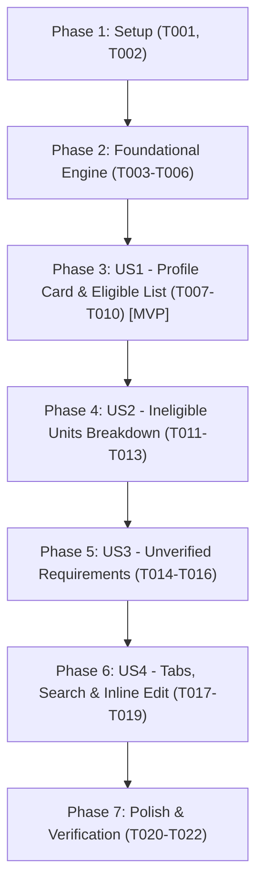

# Tasks: University Eligibility Summary

**Feature**: `001-eligibility-summary` | **Date**: 2026-08-18 | **Spec**: [specs/001-eligibility-summary/spec.md](spec.md) | **Plan**: [specs/001-eligibility-summary/plan.md](plan.md)

---

## Phase 1: Setup (Shared Infrastructure)

**Purpose**: Environment verification and shared type definitions

- [x] T001 Verify project dependencies and environment in `package.json`
- [x] T002 [P] Create and export TypeScript interfaces for `StudentProfile`, `UniversityDepartment`, `RequirementCheck`, `EligibilityStatus`, and `DepartmentEligibilityResult` in `lib/services/eligibility-engine.ts` per `data-model.md`

---

## Phase 2: Foundational (Evaluation Engine Core)

**Purpose**: Core calculation engine updates that block all user story presentations

**⚠️ CRITICAL**: Foundational evaluation logic must be in place before connecting summary UI components

- [x] T003 Enrich in-memory `universitiesDepartments` dataset with rule definitions (`minSscGPA`, `minHscGPA`, `minCombinedGPA`, `allowSecondTime`, `requiredSubjects`, `circularYear`, `requiresSubjectVerification`) in `lib/services/eligibility-engine.ts`
- [x] T004 Implement dynamic rule evaluation function `evaluateDepartmentEligibility()` that evaluates verifiable criteria (GPA, group, passing year) against the department rule and dynamically derives verification-pending status (`eligible_pending`) when verifiable criteria pass but specific subject prerequisites or circular items remain unverified from the student profile in `lib/services/eligibility-engine.ts`
- [x] T005 Implement `evaluateEligibilitySummary()` to process an applicant profile against all department rules and return aggregate counts (`eligibleCount`, `ineligibleCount`, `pendingCount`) in `lib/services/eligibility-engine.ts`
- [x] T006 Maintain backward compatibility for existing `checkEligibility()` and `getEligibleUniversities()` callers in `lib/services/eligibility-engine.ts`

**Checkpoint**: Core engine is complete, pure, and ready to feed all summary views.

---

## Phase 3: User Story 1 - Academic Profile Card & Eligible Units Presentation (Priority: P1) 🎯 MVP

**Goal**: Display the student's submitted academic profile card and a structured list of eligible university departments with satisfied criteria.

**Independent Test**: Enter valid science marks (SSC 5.0, HSC 5.0, Science, 2024) and verify that the Student Profile card and qualified department cards render with specific satisfied requirements (GPA threshold, group, seats, fees, deadlines).

### Implementation for User Story 1

- [x] T007 [US1] Update input validation handler for SSC GPA (0.00–5.00) and HSC GPA (0.00–5.00) in `app/eligibility/page.tsx`
- [x] T008 [US1] Build responsive Student Academic Profile Card component displaying submitted SSC GPA, HSC GPA, HSC Group, Passing Year, and rule-relevant derived metrics in `app/eligibility/page.tsx`
- [x] T009 [US1] Build Eligible Program Cards section rendering qualifying departments with satisfied requirements checklist, seats, admission fee, and application deadline in `app/eligibility/page.tsx`
- [x] T010 [US1] Connect program card action links to university detail routes (`/universities/[slug]`) and AI chat (`/chat`) in `app/eligibility/page.tsx`

**Checkpoint**: User Story 1 is functional: students can see their academic profile card and all eligible programs.

---

## Phase 4: User Story 2 - Ineligible Units Breakdown with Gap Explanations (Priority: P1)

**Goal**: Present departments where criteria were not met, detailing the exact failure reasons (GPA deficit, group mismatch, second-time restrictions).

**Independent Test**: Enter lower scores (SSC 3.5, HSC 3.5, Humanities, 2024) and verify that disqualified departments render with explicit failure reasons (e.g., minimum GPA delta or group incompatibility).

### Implementation for User Story 2

- [x] T011 [US2] Build Ineligible Program Cards section rendering disqualified departments in `app/eligibility/page.tsx`
- [x] T012 [US2] Render specific unsatisfied requirement messages (e.g. GPA shortfall delta, disallowed group, passing year restrictions) on each ineligible card in `app/eligibility/page.tsx`
- [x] T013 [US2] Add empty state fallback with supportive guidance when 0 programs qualify in `app/eligibility/page.tsx`

**Checkpoint**: User Stories 1 and 2 work seamlessly together, providing full transparency on both qualifications and disqualifications.

---

## Phase 5: User Story 3 - Unverified Requirements & Safe Information Disclosure (Priority: P2)

**Goal**: Safely flag unverified criteria (such as individual subject letter grades or pending circular updates) with prominent badges and disclaimers.

**Independent Test**: Evaluate programs with subject prerequisites (e.g. Math/Physics) against aggregate GPAs and verify that "Provisionally Eligible (Verification Pending)" badges and warning checklists appear.

### Implementation for User Story 3

- [x] T014 [US3] Implement `eligible_pending` status handling and styling (amber badge and disclaimer) in `app/eligibility/page.tsx`
- [x] T015 [US3] Render unverified requirements checklist and circular disclaimer notices on program cards in `app/eligibility/page.tsx`
- [x] T016 [US3] Add footer advisory reminding students to verify official circulars on institutional portals in `app/eligibility/page.tsx`

**Checkpoint**: User Stories 1, 2, and 3 are fully operational with complete Truth-First compliance.

---

## Phase 6: User Story 4 - Filtering, Quick Search & Inline Profile Recalculation (Priority: P3)

**Goal**: Provide interactive tab controls (`All`, `Eligible`, `Ineligible`), search by university/department, and seamless inline recalculation.

**Independent Test**: Toggle between tabs, search for `"BUET"`, or edit GPA values directly from the summary view and verify instant filtering and recalculation.

### Implementation for User Story 4

- [x] T017 [US4] Implement interactive tab bar (`All`, `Eligible`, `Ineligible`) with real-time counter badges in `app/eligibility/page.tsx`
- [x] T018 [US4] Implement real-time keyword search filter (filtering by university name, department, or degree program) in `app/eligibility/page.tsx`
- [x] T019 [US4] Implement "Edit Academic Profile" / recalculate action reusing the existing eligibility form/UI pattern to modify marks and recalculate results seamlessly in `app/eligibility/page.tsx`

**Checkpoint**: Full interactive summary dashboard is complete and responsive across all viewports.

---

## Phase 7: Polish & Verification

**Purpose**: Cross-cutting quality checks and scenario validation

- [x] T020 [P] Validate responsiveness on mobile (375px), tablet (768px), and desktop (1280px+) in `app/eligibility/page.tsx`
- [x] T021 Execute all end-to-end test scenarios (Scenarios A–D) documented in `quickstart.md`
- [x] T022 Run project linter and TypeScript type-check (`pnpm run lint`) to ensure zero errors and clean build

---

## Dependencies & Execution Order

---

## Parallel Opportunities

- **Phase 1**: `T002` (Types) can run in parallel with project setup check `T001`.
- **Phase 7**: `T020` (Responsive testing) can run in parallel with `T021` (Quickstart scenarios).

---

## Implementation Strategy (MVP First)

1. **Step 1 (Foundation)**: Complete Phase 1 & 2 in `lib/services/eligibility-engine.ts`.
2. **Step 2 (MVP)**: Complete Phase 3 (US1) in `app/eligibility/page.tsx` $\rightarrow$ Validate profile card and eligible programs.
3. **Step 3 (Incremental Expansion)**: Complete Phase 4 (US2) $\rightarrow$ Phase 5 (US3) $\rightarrow$ Phase 6 (US4).
4. **Step 4 (Validation)**: Run Quickstart scenarios and linting in Phase 7.
