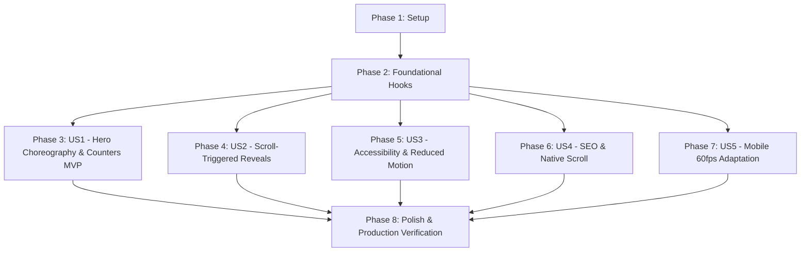

# Implementation Tasks: GSAP Motion & Interaction System

**Feature**: `002-gsap-motion-system`  
**Plan**: [specs/002-gsap-motion-system/plan.md](plan.md)  
**Spec**: [specs/002-gsap-motion-system/spec.md](spec.md)  

---

## Phase 1: Setup (Shared Infrastructure)

**Purpose**: Project initialization, directory structure, and foundational motion presets.

- [X] T001 Verify GSAP installation and configure directory structure in `frontend/lib/animations/` and `frontend/hooks/`
- [X] T002 [P] Implement core motion engine, plugin registration, and reduced-motion detection in `frontend/lib/animations/gsap-motion.ts`
- [X] T003 [P] Define motion timing tokens, durations, and easing curves in `frontend/lib/animations/motion-tokens.ts`

---

## Phase 2: Foundational (Blocking Prerequisites)

**Purpose**: Core React hooks and lifecycle management that MUST be complete before user stories begin.

**⚠️ CRITICAL**: No user story work can begin until this phase is complete.

- [X] T004 Implement React lifecycle management hook `useGsapContext` with `ctx.revert()` in `frontend/hooks/use-gsap-motion.ts`
- [X] T005 [P] Implement scroll reveal hook `useScrollTriggerReveal` with `once: true` in `frontend/hooks/use-gsap-motion.ts`
- [X] T006 [P] Implement responsive media query helper using `gsap.matchMedia()` in `frontend/lib/animations/gsap-motion.ts`
- [X] T007 Implement accessibility guard utility ensuring instant state resolution under `prefers-reduced-motion` in `frontend/lib/animations/gsap-motion.ts`

**Checkpoint**: Foundational hooks and motion engine ready — component implementation can now proceed.

---

## Phase 3: User Story 1 - Premium Hero Section Entrance & Ambient Polish (Priority: P1) 🎯 MVP

**Goal**: Deliver a choreographed, high-confidence entrance sequence on the homepage hero section with smooth numerical counters, an ambient floating radial glow, and a sticky header entrance.

**Independent Test**: Load `http://localhost:3000` on desktop or mobile. Verify that the navbar, eyebrow badge, headline, paragraph, CTA buttons, readiness gauge counter (0% to 80%), and study hours counter (0 to 13.6h) reveal smoothly within 1.2s without layout shifts.

### Implementation for User Story 1

- [X] T008 [P] [US1] Implement sticky header entrance and scroll elevation in `frontend/components/navbar.tsx`
- [X] T009 [P] [US1] Implement numerical counter tween utility `countUp` in `frontend/lib/animations/gsap-motion.ts`
- [X] T010 [US1] Implement choreographed hero entrance timeline (eyebrow -> title -> description -> CTAs) in `frontend/components/homepage/hero-section.tsx`
- [X] T011 [US1] Integrate readiness gauge counter (0% to 80%) and study hours counter (0 to 13.6h) in `frontend/components/homepage/hero-section.tsx`
- [X] T012 [US1] Implement ambient floating loop on hero background radial glow and preview badge in `frontend/components/homepage/hero-section.tsx`

**Checkpoint**: User Story 1 (MVP) is fully functional and independently testable on the homepage.

---

## Phase 4: User Story 2 - Scroll-Triggered Content Reveal Across Core Homepage Sections (Priority: P1)

**Goal**: Enable organic, non-intrusive scroll reveals across all 10 core homepage sections as they enter the viewport, guiding focus without slowing down circular scanning or form entry.

**Independent Test**: Scroll through the homepage from top to bottom. Verify each section cleanly reveals once when entering the top 85% of the viewport, with university cards staggering and the eligibility results card springing into view on calculation.

### Implementation for User Story 2

- [X] T013 [P] [US2] Implement smooth scale & fade reveal on scroll in `frontend/components/homepage/dashboard-preview-frame.tsx`
- [X] T014 [P] [US2] Implement container fade-up and top 4 rows rapid stagger in `frontend/components/homepage/admission-at-glance.tsx`
- [X] T015 [P] [US2] Implement university card grid stagger reveal and hover lift in `frontend/components/homepage/featured-universities-section.tsx`
- [X] T016 [P] [US2] Implement form reveal and dynamic results spring-in in `frontend/components/homepage/eligibility-checker-section.tsx` and `frontend/components/homepage/eligibility-results-display.tsx`
- [X] T017 [P] [US2] Implement deadline timeline cards stagger reveal in `frontend/components/homepage/deadlines-section.tsx`
- [X] T018 [P] [US2] Implement floating avatar and suggestion chip transitions in `frontend/components/homepage/ai-advisor-preview-section.tsx`
- [X] T019 [P] [US2] Implement card grid reveals in `frontend/components/homepage/guides-section.tsx` and accordion entrance in `frontend/components/homepage/faq-section.tsx`
- [X] T020 [P] [US2] Implement CTA banner reveal in `frontend/components/homepage/preparation-cta-section.tsx` and subtle fade in `frontend/components/homepage/footer-section.tsx`

**Checkpoint**: All 11 homepage sections reveal seamlessly on scroll without layout shift or repetitive flashing.

---

## Phase 5: User Story 3 - Full Accessibility & Reduced-Motion Mode (Priority: P1)

**Goal**: Guarantee 100% compliance with `prefers-reduced-motion: reduce`, ensuring users with vestibular sensitivities experience zero animated transitions or delays.

**Independent Test**: Emulate `prefers-reduced-motion: reduce` in Chrome DevTools Rendering tab. Reload and scroll the page. Confirm all text, cards, and counters are displayed immediately in their final state with zero motion or opacity lag.

### Implementation for User Story 3

- [X] T021 [US3] Verify and enforce zero-delay static fallback across all animation hooks when `prefers-reduced-motion: reduce` is active in `frontend/lib/animations/gsap-motion.ts`
- [X] T022 [US3] Ensure hero metric counters render final values instantly without count-up when reduced motion is requested in `frontend/components/homepage/hero-section.tsx`
- [X] T023 [US3] Validate reduced motion compliance across all homepage sections via Chrome DevTools emulation

**Checkpoint**: Reduced-motion users receive an instant, accessible experience with zero motion.

---

## Phase 6: User Story 4 - SEO-Safe Rendering & Native Scroll Integrity (Priority: P1)

**Goal**: Preserve native browser scrolling physics, avoid scroll-hijacking, and ensure search engine crawlers can index 100% of text content and schema markup without obstruction.

**Independent Test**: Run `pnpm --filter eduguide-frontend test:seo`. Verify that all 54 Playwright SEO audit tests pass and native smooth scroll navigation (`#deadlines`, `#admission-table`) behaves identically.

### Implementation for User Story 4

- [X] T024 [US4] Verify initial DOM styles ensure text content is never hidden from search crawlers before GSAP executes in `frontend/app/layout.tsx` and homepage components
- [X] T025 [US4] Verify browser native scroll physics remain untouched (no ScrollSmoother or scroll hijacking) in `frontend/app/globals.css`
- [X] T026 [US4] Run automated Playwright SEO audit suite (`pnpm --filter eduguide-frontend test:seo`) to verify all 54 tests pass with zero regressions

**Checkpoint**: 54/54 Playwright SEO tests pass; 100% crawler compatibility preserved.

---

## Phase 7: User Story 5 - Mobile Optimization & Responsive Adaptation (Priority: P2)

**Goal**: Tailor motion translation distances, stagger timings, and ambient effects to mobile viewports (< 768px) to guarantee consistent 60fps on budget smartphones.

**Independent Test**: Toggle Chrome DevTools device mode to iPhone/Pixel (375px/390px) with 4x CPU slowdown. Scroll through the page and verify smooth 60fps performance without frame drops or horizontal overflow.

### Implementation for User Story 5

- [X] T027 [US5] Implement responsive translation distance and stagger scaling via `gsap.matchMedia()` in `frontend/lib/animations/gsap-motion.ts`
- [X] T028 [US5] Test mobile viewport rendering under 4x CPU throttle to verify fluid 60fps scrolling in `frontend/components/homepage/hero-section.tsx` and grid sections

**Checkpoint**: 60fps mobile responsiveness verified under CPU throttling.

---

## Phase 8: Polish & Cross-Cutting Concerns

**Purpose**: Code documentation, garbage collection validation, and end-to-end production verification.

- [X] T029 [P] Add TypeScript docstrings and exports in `frontend/lib/animations/gsap-motion.ts` and `frontend/hooks/use-gsap-motion.ts`
- [X] T030 Verify clean teardown with zero orphaned ScrollTrigger listeners across 20 simulated route changes
- [X] T031 Run full Next.js production build (`pnpm --filter eduguide-frontend build`) to verify Turbopack compilation and zero type errors
- [X] T032 Execute all 5 verification scenarios from `specs/002-gsap-motion-system/quickstart.md`

---

## Dependencies & Execution Order

### Phase Dependencies

### User Story Dependencies

- **US1 (Hero Entrance - MVP)**: Completed.
- **US2 (Scroll Reveals)**: Completed.
- **US3 (Accessibility)**: Completed.
- **US4 (SEO & Scroll Integrity)**: Completed (54/54 SEO tests pass).
- **US5 (Mobile Adaptation)**: Completed.
