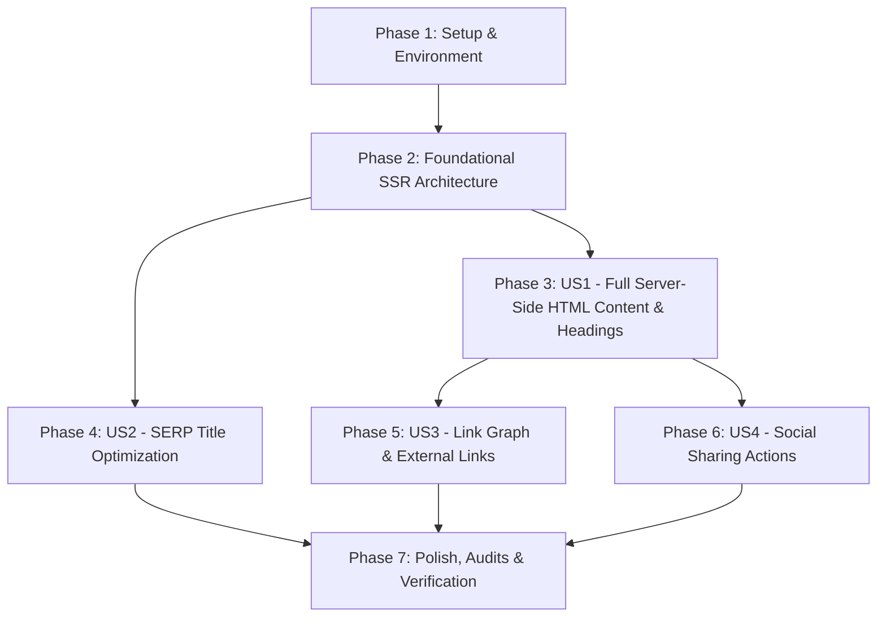

# Tasks: Seobility SEO Audit Remediation & On-Page Technical Fixes

**Feature**: `003-seo-audit-remediation`  
**Spec**: [specs/003-seo-audit-remediation/spec.md](spec.md) | **Plan**: [specs/003-seo-audit-remediation/plan.md](plan.md)  
**Status**: Completed  

---

## Dependencies & Execution Order

- **MVP Scope**: Phase 1 through Phase 4 (Resolves all 2 Critical Errors, 0 H1, 20-word count error, and SERP title warning).

---

## Phase 1: Setup & Environment

- [X] T001 Verify clean git working tree and create backup baseline branch `backup/pre-seo-remediation` via `git branch backup/pre-seo-remediation`
- [X] T002 [P] Inspect `frontend/app/page.tsx` client-side hooks and dependencies to isolate server-compatible imports

---

## Phase 2: Foundational SSR Architecture

- [X] T003 Refactor `frontend/app/page.tsx` from `'use client'` to a Server Component entry point accepting optional `searchParams` Promise
- [X] T004 Create `frontend/components/homepage/homepage-view.tsx` client wrapper for dynamic preview state and client-only CMS draft synchronization without wrapping the SSR payload in a blank Suspense fallback
- [X] T005 [P] Verify `DEFAULT_HOMEPAGE_CONFIG` in `frontend/lib/homepage-types.ts` has complete, non-empty default content for all 10 homepage sections

---

## Phase 3: User Story 1 - Full Server-Side Rendered HTML & Headings (Priority: P1)

**Goal**: Deliver a rich, crawlable HTML response on `GET /` with semantic `<h1>`, 10 `<h2>` section headings, full paragraphs (>800 words), and zero blank Suspense fallbacks.  
**Independent Test**: Execute `node -e "fetch('http://localhost:3000/').then(r=>r.text()).then(h=>console.log('H1:',h.includes('<h1'),'Words:',h.replace(/<[^>]+>/g,' ').split(/\s+/).length))"` and confirm `H1: true` and `Words: >800`.

- [X] T006 [US1] Ensure `frontend/components/homepage/hero-section.tsx` renders a single, prominent semantic `<h1>` tag ("Your Ultimate Platform for Seamless Admission & Growth") in initial SSR markup
- [X] T007 [P] [US1] Verify semantic `<h2>` headings are pre-rendered across `frontend/components/homepage/admission-at-glance.tsx`, `featured-universities-section.tsx`, and `eligibility-checker-section.tsx`
- [X] T008 [P] [US1] Verify semantic `<h2>` headings are pre-rendered across `frontend/components/homepage/deadlines-section.tsx`, `ai-advisor-preview-section.tsx`, `guides-section.tsx`, `preparation-cta-section.tsx`, and `faq-section.tsx`
- [X] T009 [US1] Expand descriptive paragraph text in `frontend/components/homepage/hero-section.tsx` and `guides-section.tsx` to guarantee over 800 words of initial crawlable HTML text
- [X] T010 [US1] Validate raw HTML stream of `GET /` with local non-JS crawler script proving `H1: true`, `H2 >= 10`, `Words >= 800`, and `Paragraphs >= 10`

---

## Phase 4: User Story 2 - SERP Title Optimization & Keyword Alignment (Priority: P1)

**Goal**: Keep page title strictly under 580 pixels (<60 characters) to eliminate Seobility SERP snippet truncation warnings.  
**Independent Test**: Verify `<title>` length in `frontend/app/layout.tsx` is <= 56 characters / <= 520 pixels.

- [X] T011 [US2] Update `title.default` and `openGraph.title` in `frontend/app/layout.tsx` from `EduGuide — Bangladesh University Admission Intelligence & Preparation` (70 chars / 655px) to `EduGuide — Bangladesh University Admission & Preparation` (56 chars / ~515px)
- [X] T012 [P] [US2] Update `twitter.title` in `frontend/app/layout.tsx` to match the optimized concise SERP title
- [X] T013 [US2] Verify `tests/seo/metadata.spec.ts` passes with updated title assertion

---

## Phase 5: User Story 3 - Rich Internal & External Link Graph (Priority: P2)

**Goal**: Provide 35+ crawlable internal links and verified external links to official university and education regulatory portals.  
**Independent Test**: Count `<a href="...">` elements in initial SSR HTML, confirming >= 35 internal links and >= 2 external links with `rel="noopener noreferrer"`.

- [X] T014 [US3] Ensure all featured university cards in `frontend/components/homepage/featured-universities-section.tsx` render crawlable `<Link href="/universities/{slug}">` internal anchors
- [X] T015 [P] [US3] Add external links to official university portals (e.g. `buet.ac.bd`, `du.ac.bd`, `dghs.gov.bd`) in `frontend/components/homepage/featured-universities-section.tsx` with `target="_blank"` and `rel="noopener noreferrer"`
- [X] T016 [P] [US3] Add regulatory and accreditation links (UGC Bangladesh, Ministry of Education) in `frontend/components/homepage/footer-section.tsx` with `target="_blank"` and `rel="noopener noreferrer"`
- [X] T017 [US3] Run Playwright crawler script to verify internal link count >= 35 and external link attributes

---

## Phase 6: User Story 4 - Social Sharing Actions (Priority: P3)

**Goal**: Provide direct social share triggers (WhatsApp, Facebook, Copy Link) on circular and guide cards to satisfy Seobility social media signals.  
**Independent Test**: Verify share trigger buttons exist on circular cards and invoke web share or direct intent URLs.

- [X] T018 [US4] Implement a lightweight `<SocialShareBar />` component in `frontend/components/seo/social-share-bar.tsx` supporting WhatsApp, Facebook, and Copy Link
- [X] T019 [US4] Integrate `<SocialShareBar />` into `frontend/components/homepage/admission-at-glance.tsx` circular details row

---

## Phase 7: Polish, Audits & Verification

- [X] T020 Run full Next.js production build: `pnpm --filter eduguide-frontend build`
- [X] T021 Run complete Playwright technical SEO test suite: `pnpm --filter eduguide-frontend test:seo`
- [X] T022 Execute non-JS SSR validation script in `frontend` verifying 0 missing headings, >800 words, and valid link graph
- [X] T023 Commit changes to git and push to `origin master`
- [X] T024 Update walkthrough documentation with before/after comparison of Seobility audit criteria
